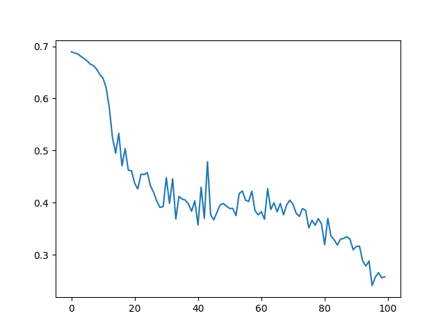

# README

## 1. Training Log

### Hyperparameters

- Hidden size = 256
- Learning rate = 0.001
- Number of iterations = 100000
- Activation function for hidden layer: tanh

### Loss Figure

1. Training loss  of 200 examples

   

2. Training loss  of 2000 examples

   

3. Training loss  of 20000 examples

   

## 2. Test Results

Tested on 100 randomly generated examples (See 'testing_data_100.txt').

1. Model of 200 training examples

   Accuracy = 0.71

   See full results at [predictions/predictions_200.txt](predictions/predictions_200.txt)

2. Model of 2000 training examples

   Accuracy = 0.67

   See full results at [predictions/predictions_2000.txt](predictions/predictions_2000.txt)

3. Model of 20000 training examples

   Accuracy = 0.71

   See full results at [predictions/predictions_20000.txt](predictions/predictions_20000.txt)

## 3. Instructions

To run tests on the 3 models:

1. **Place your test set 'test.txt' under the project root** directory

2. **Run command at project root directory:**
   - **python test.py 200 test.txt**
   - **python test.py 2000 test.txt**
   - **python test.py 20000 test.txt**
3. Test results and <u>accuracy will be printed</u>, and full results will be saved to file 'predictions_<numberofexamples>.txt' at root directory.
